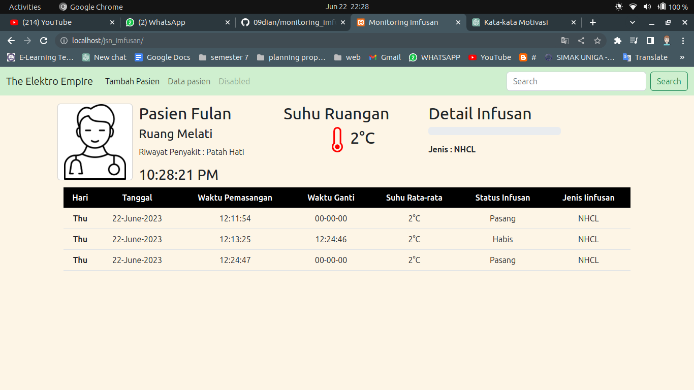
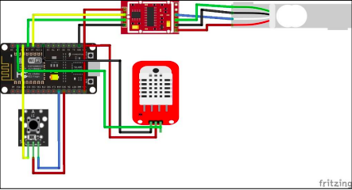

# Sistem Monitoring Berbasis Infusan

Selamat datang di proyek Sistem Monitoring Berbasis Infusan! Proyek ini bertujuan untuk mengembangkan sistem yang memonitoring proses infusan secara real-time menggunakan perangkat Arduino dan basis data MySQL.

segala program arduino Mysql  dan data base sudah ada di dalam ini

## Rangkaian

## Persyaratan

Sebelum menjalankan sistem ini, pastikan Anda telah memenuhi persyaratan berikut:

1. Instal XAMPP: Pastikan Anda telah menginstal XAMPP di komputer Anda. XAMPP akan digunakan untuk menjalankan server web dan basis data lokal.

2. Buat Tabel: Setelah menginstal XAMPP, buatlah sebuah tabel di basis data MySQL dengan nama "tubes1". Tabel ini akan digunakan untuk menyimpan data monitoring infusan.

3. iImport Database MySQL di PHPMyAdmin yang ada forder data_base atau lihat terlebih dahulu tutorial di youtubu :  https://www.youtube.com/watch?v=ZRrwZzRmpGk

4. Ganti nama forder yang sudah di download dari gihub menjadi tubes_imfusan

## Panduan Penggunaan

Berikut adalah langkah-langkah untuk menjalankan Sistem Monitoring Berbasis Infusan:

1. Jalankan XAMPP: Mulailah dengan menjalankan XAMPP di komputer Anda. Pastikan bahwa Apache dan MySQL telah diaktifkan.

2. Impor Tabel: Impor file "tubes1.sql" ke dalam basis data MySQL Anda dengan menggunakan phpMyAdmin atau perintah SQL yang sesuai. Pastikan tabel "tubes1" telah terbuat dengan benar.

3. Hubungkan Arduino: Hubungkan perangkat Arduino ke komputer dan unggah kode Arduino yang telah Anda modifikasi ke dalamnya. Pastikan Arduino terhubung ke jaringan Wi-Fi yang sesuai.

4. Jalankan Aplikasi: Buka aplikasi monitoring sistem di browser Anda dengan mengakses `http://localhost/tubes_imfusan`. Anda akan melihat antarmuka pengguna yang menampilkan data infusan secara real-time.

5. Mulai Monitoring: Sekarang, sistem akan mulai memantau proses infusan. Anda dapat melihat data yang diperbarui secara otomatis pada antarmuka pengguna.

## Kontribusi

Jika Anda ingin berkontribusi pada pengembangan proyek ini, Anda dapat melakukan fork pada repositori ini dan mengirimkan pull request dengan perubahan yang diusulkan. Kami sangat menghargai kontribusi dari komunitas!

## Pertanyaan dan Dukungan

Jika Anda memiliki pertanyaan atau memerlukan dukungan, jangan ragu untuk menghubungi tim pengembang melalui [email](09dianm@gmail.com) atau buka [issue](https://github.com/09dian/Sistem-Monitoring-Infusan/tree/main) di repositori proyek ini.

## Lisensi

Proyek ini dilisensikan di bawah The Elektro Empire. Silakan merujuk ke berkas `TUGAS BESAR FAKULTAS TEKNIK ELEKTRO UNIGA` untuk informasi lebih lanjut.

Terima kasih telah menggunakan Sistem Monitoring Berbasis Infusan! Kami berharap sistem ini dapat memberikan manfaat dalam memantau proses infusan secara